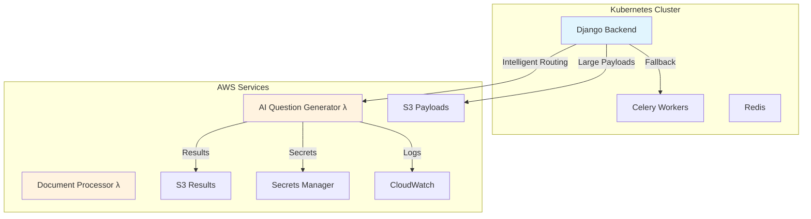

# ExamX-V2 Lambda Migration Guide

## 🚀 **Complete Implementation Overview**

This guide provides step-by-step instructions for migrating your ExamX-V2 backend from pure Celery to a hybrid Celery/AWS Lambda architecture. The implementation provides intelligent task routing, cost optimization, and seamless fallback capabilities.

---

## 📋 **What Was Implemented**

### ✅ **Core Components**

1. **AWS Lambda Client** (`utility/aws_lambda_client.py`)
   - Centralized Lambda invocation with boto3
   - Intelligent routing decisions
   - S3 integration for large payloads
   - Circuit breaker pattern for reliability
   - Cost tracking and optimization

2. **Hybrid Task Decorator** (`utility/hybrid_task_decorator.py`)
   - Drop-in replacement for `@shared_task`
   - Automatic Lambda vs Celery routing
   - Backward compatibility with existing code
   - Fallback mechanisms

3. **Lambda Functions**
   - **AI Question Generator** (`lambda_functions/ai_question_generator/`)
   - **Document Processor** (`lambda_functions/document_processor/`)
   - Complete with dependencies and error handling

4. **Database Models** (`admin_app/models/lambda_models.py`)
   - `LambdaTaskExecution` for task tracking
   - `LambdaFunctionMetrics` for performance monitoring
   - Complete with indexes and relationships

5. **API Endpoints** (`admin_app/views/lambda_task_views.py`)
   - Task status monitoring
   - Performance metrics
   - Management dashboard
   - RESTful interface

6. **Infrastructure as Code**
   - **Terraform configuration** (`aws_infrastructure/terraform/`)
   - **IAM policies and roles**
   - **S3 buckets with lifecycle policies**
   - **CloudWatch logging**

7. **Kubernetes Integration**
   - **Updated deployments** with Lambda configuration
   - **ConfigMaps** for environment-specific settings
   - **Secrets management** via AWS Secrets Manager
   - **IRSA (IAM Roles for Service Accounts)** integration

---

## 🏗️ **Architecture Overview**



---

## 🚀 **Step-by-Step Migration**

### **Phase 1: Infrastructure Setup**

#### 1. **Deploy AWS Infrastructure**

```bash
# Navigate to your project directory
cd /path/to/ExamX-V2-Backend-project/backend-dev

# Make deployment script executable (already done)
chmod +x deployment/deploy_lambda_functions.sh

# Deploy infrastructure
./deployment/deploy_lambda_functions.sh deploy
```

This script will:
- ✅ Package Lambda functions
- ✅ Deploy Terraform infrastructure
- ✅ Create S3 buckets
- ✅ Set up IAM roles and policies
- ✅ Deploy Lambda functions
- ✅ Create placeholder secrets

#### 2. **Update AWS Secrets**

```bash
# Update OpenAI API Key
aws secretsmanager update-secret \
    --secret-id "examx/openai-api-key" \
    --secret-string '{"OPENAI_API_KEY":"your-actual-openai-key"}' \
    --region ap-south-1

# Update LlamaParse API Key
aws secretsmanager update-secret \
    --secret-id "examx/llamaparse-api-key" \
    --secret-string '{"LLAMAPARSE_API_KEY":"your-actual-llamaparse-key"}' \
    --region ap-south-1

# Update Internal API Token
aws secretsmanager update-secret \
    --secret-id "examx/api-tokens" \
    --secret-string '{"EXAMX_API_TOKEN":"your-internal-api-token"}' \
    --region ap-south-1
```

### **Phase 2: Django Backend Updates**

#### 1. **Update Django Settings**

Add to your main `settings.py`:

```python
# At the end of settings.py
from examx.lambda_settings import configure_lambda_settings
configure_lambda_settings()
```

#### 2. **Add Lambda Models to Database**

```python
# Add to your INSTALLED_APPS if not already present
INSTALLED_APPS = [
    # ... existing apps ...
    'admin_app',
]
```

Create and run migrations:

```bash
python manage.py makemigrations admin_app
python manage.py migrate
```

#### 3. **Update URL Configuration**

Add to your main `urls.py`:

```python
from django.urls import path, include

urlpatterns = [
    # ... existing patterns ...
    path('api/', include('admin_app.urls_lambda')),
]
```

### **Phase 3: Task Migration**

#### 1. **Gradual Migration Approach**

Start with **AI Question Generation** (lowest risk, highest benefit):

**Option A: Update Existing Views (Recommended)**

Replace in `ai_app/views/question_generator_views.py`:

```python
# OLD CODE (around line 968):
generate_ai_questions_in_celery.apply_async(kwargs={
    "question_gen_template": question_gen_template,
    "database_name": request.organization['site_name'],
    "task_db_id": question_task_id
})

# NEW CODE:
from ai_app.views.migrated_question_generator import generate_ai_questions_hybrid

generate_ai_questions_hybrid.apply_async(kwargs={
    "question_gen_template": question_gen_template,
    "database_name": request.organization['site_name'],
    "task_db_id": question_task_id
})
```

**Option B: Use Migration Command**

```bash
# Migrate active tasks
python manage.py migrate_to_lambda --task-type ai_generation

# Dry run first to see what would be migrated
python manage.py migrate_to_lambda --task-type ai_generation --dry-run
```

#### 2. **Document Processing Migration**

Update document processing tasks:

```python
# In ai_app/views/question_paper_parser.py
from utility.hybrid_task_decorator import hybrid_task

@hybrid_task(
    lambda_function_name='examx-v2-document-processor-production',
    task_type='document_processing',
    fallback_to_celery=True
)
def process_paper_task(temp_pdf_path, processing_id, db, public_url):
    # Existing implementation remains the same
    # Lambda will handle the execution automatically
    pass
```

### **Phase 4: Kubernetes Deployment**

#### 1. **Update EKS Cluster with IRSA**

First, get your EKS OIDC issuer:

```bash
aws eks describe-cluster --name your-cluster-name --query "cluster.identity.oidc.issuer" --output text
```

Update the Terraform `locals` in `aws_infrastructure/terraform/main.tf`:

```hcl
locals {
  oidc_issuer = "oidc.eks.ap-south-1.amazonaws.com/id/YOUR_ACTUAL_OIDC_ISSUER"
}
```

Re-run Terraform:

```bash
cd aws_infrastructure/terraform
terraform apply
```

#### 2. **Deploy Updated Kubernetes Configuration**

```bash
# Update environment-specific configurations
cd ExamX-V2-Backend-Deployment/k8s/overlays/prod

# Deploy updated configuration
kubectl apply -k .

# Verify deployment
kubectl get pods -n examxv2-production
kubectl logs -f deployment/examxv2-backend -n examxv2-production
```

#### 3. **Verify Lambda Integration**

Check that environment variables are properly set:

```bash
kubectl exec -it deployment/examxv2-backend -n examxv2-production -- env | grep LAMBDA
```

### **Phase 5: Testing and Monitoring**

#### 1. **Test Lambda Functions**

```bash
# Test AI Question Generator
curl -X POST "https://your-api-domain/api/ai-question-bank/generate/" \
  -H "Authorization: Bearer your-token" \
  -H "Content-Type: application/json" \
  -d '{
    "filters": {
      "course_id": ["test-course"],
      "mark": 5,
      "question_type_code": ["MCQ"]
    }
  }'
```

#### 2. **Monitor Task Execution**

```bash
# View Lambda metrics
curl -X GET "https://your-api-domain/api/lambda-metrics/dashboard/" \
  -H "Authorization: Bearer your-token"

# List recent tasks
curl -X GET "https://your-api-domain/api/lambda-tasks/?limit=10" \
  -H "Authorization: Bearer your-token"
```

#### 3. **Check CloudWatch Logs**

```bash
# View Lambda logs
aws logs tail /aws/lambda/examx-v2-ai-question-generator-production --follow

# View application logs
kubectl logs -f deployment/examxv2-backend -n examxv2-production
```

---

## ⚙️ **Configuration Options**

### **Environment Variables**

| Variable | Default | Description |
|----------|---------|-------------|
| `LAMBDA_ENABLE_AI_GENERATION` | `true` | Enable Lambda for AI tasks |
| `LAMBDA_ENABLE_DOCUMENT_PROCESSING` | `true` | Enable Lambda for document processing |
| `LAMBDA_FALLBACK_TO_CELERY` | `true` | Fallback to Celery on Lambda failure |
| `LAMBDA_MAX_DAILY_COST_USD` | `100.0` | Daily cost limit |
| `LAMBDA_CIRCUIT_BREAKER_ENABLED` | `true` | Enable circuit breaker |

### **Environment-Specific Settings**

**Development:**
```yaml
# In k8s/overlays/dev/lambda-config-patch.yaml
LAMBDA_ENABLE_AI_GENERATION: "false"
LAMBDA_ENABLE_DOCUMENT_PROCESSING: "false"
LAMBDA_MAX_DAILY_COST_USD: "10.0"
```

**Staging:**
```yaml
LAMBDA_ENABLE_AI_GENERATION: "true"
LAMBDA_ENABLE_DOCUMENT_PROCESSING: "true"
LAMBDA_MAX_DAILY_COST_USD: "50.0"
```

**Production:**
```yaml
LAMBDA_ENABLE_AI_GENERATION: "true"
LAMBDA_ENABLE_DOCUMENT_PROCESSING: "true"
LAMBDA_MAX_DAILY_COST_USD: "100.0"
```

---

## 📊 **Monitoring and Metrics**

### **Key Metrics to Track**

1. **Performance Metrics**
   - Task execution time (Lambda vs Celery)
   - Success/failure rates
   - Memory usage
   - Cold start frequency

2. **Cost Metrics**
   - Daily Lambda costs
   - Cost per task execution
   - Savings compared to EC2/Celery

3. **Reliability Metrics**
   - Circuit breaker activations
   - Fallback usage rate
   - Error rates by function

### **Dashboard Endpoints**

```bash
# Get comprehensive metrics
GET /api/lambda-metrics/dashboard/?days=7

# Get task list with filters
GET /api/lambda-tasks/?status=SUCCESS&function_name=ai-question-generator

# Get specific task details
GET /api/lambda-tasks/{task_id}/
```

---

## 🔧 **Troubleshooting**

### **Common Issues**

#### 1. **Lambda Function Not Found**
```
Error: Function not found: examx-v2-ai-question-generator-production
```
**Solution:** Verify function names in AWS Console and update `lambda_settings.py`

#### 2. **Permission Denied**
```
Error: User is not authorized to perform: lambda:InvokeFunction
```
**Solution:** Check IAM roles and IRSA configuration

#### 3. **Payload Too Large**
```
Error: Request must be smaller than 6291456 bytes
```
**Solution:** The system automatically uses S3 for large payloads. Check S3 permissions.

#### 4. **Circuit Breaker Open**
```
Warning: Circuit breaker is open for ai_question_generation
```
**Solution:** Check Lambda function logs and health. Circuit breaker resets automatically after timeout.

### **Debug Commands**

```bash
# Check Lambda function status
aws lambda get-function --function-name examx-v2-ai-question-generator-production

# View recent invocations
aws logs filter-log-events --log-group-name /aws/lambda/examx-v2-ai-question-generator-production --start-time $(date -d '1 hour ago' +%s)000

# Test Django Lambda client
python manage.py shell
>>> from utility.aws_lambda_client import lambda_client
>>> lambda_client.should_use_lambda('ai_question_generation', 1000)
```

---

## 💰 **Cost Optimization**

### **Estimated Costs**

**Before (Celery only):**
- EC2 instances: ~$200/month
- Redis: ~$50/month
- **Total: ~$250/month**

**After (Hybrid):**
- EC2 instances (reduced): ~$150/month
- Redis: ~$50/month
- Lambda: ~$30-80/month (depending on usage)
- S3: ~$10/month
- **Total: ~$240-290/month**

**Benefits:**
- 🚀 **Better scalability** for AI workloads
- 🔧 **Reduced maintenance** overhead
- 📈 **Pay-per-use** pricing for heavy tasks
- ⚡ **Faster processing** for document tasks

### **Cost Monitoring**

The system automatically tracks costs and provides alerts:

```python
# In your Django admin or monitoring dashboard
from admin_app.models.lambda_models import LambdaTaskExecution

# Get daily costs
daily_cost = LambdaTaskExecution.objects.filter(
    created_at__date=today
).aggregate(total_cost=Sum('estimated_cost_usd'))['total_cost']
```

---

## 🔄 **Rollback Plan**

If you need to rollback to pure Celery:

1. **Disable Lambda routing:**
```bash
kubectl set env deployment/examxv2-backend LAMBDA_ENABLE_AI_GENERATION=false LAMBDA_ENABLE_DOCUMENT_PROCESSING=false -n examxv2-production
```

2. **Wait for active Lambda tasks to complete**

3. **Remove Lambda configuration:**
```bash
# Remove Lambda configs from kustomization.yaml
git revert <lambda-commit-hash>
kubectl apply -k ExamX-V2-Backend-Deployment/k8s/overlays/prod
```

---

## 📚 **Additional Resources**

### **Code Examples**

1. **Creating a New Hybrid Task:**
```python
from utility.hybrid_task_decorator import hybrid_task

@hybrid_task(
    lambda_function_name='your-lambda-function',
    task_type='your_task_type',
    fallback_to_celery=True
)
def your_new_task(arg1, arg2, database_name=None, user_id=None):
    # Your task implementation
    return {"result": "success"}
```

2. **Checking Task Status:**
```python
from utility.hybrid_task_decorator import get_hybrid_task_status

status = get_hybrid_task_status(task_id, database_name)
print(f"Task {task_id} is {status['status']}")
```

### **Monitoring Queries**

```sql
-- Get Lambda task performance
SELECT 
    function_name,
    AVG(execution_duration_ms) as avg_duration,
    COUNT(*) as total_tasks,
    SUM(CASE WHEN status = 'SUCCESS' THEN 1 ELSE 0 END) as successful_tasks
FROM lambda_task_execution 
WHERE created_at >= NOW() - INTERVAL '24 hours'
GROUP BY function_name;

-- Get cost analysis
SELECT 
    DATE(created_at) as date,
    function_name,
    SUM(estimated_cost_usd) as daily_cost,
    COUNT(*) as task_count
FROM lambda_task_execution 
WHERE created_at >= NOW() - INTERVAL '30 days'
GROUP BY DATE(created_at), function_name
ORDER BY date DESC;
```

---

## 🎉 **Success Criteria**

Your migration is successful when:

- ✅ AI question generation tasks run on Lambda (check logs)
- ✅ Document processing tasks run on Lambda (check logs)
- ✅ Fallback to Celery works when Lambda is unavailable
- ✅ Cost tracking is accurate in the dashboard
- ✅ Performance metrics show improved response times
- ✅ No increase in error rates
- ✅ All existing functionality works unchanged

---

## 🚨 **Support**

If you encounter issues:

1. **Check the logs:** `kubectl logs -f deployment/examxv2-backend`
2. **Review Lambda logs:** AWS CloudWatch Console
3. **Test Lambda functions:** Use the test endpoints in the deployment script
4. **Check configuration:** Verify environment variables and secrets

The hybrid architecture is designed to be **safe and gradual**. You can enable/disable Lambda for specific task types at any time without affecting your users.

---

**🎯 Ready to deploy? Start with Phase 1 and work through each phase systematically. The system is designed to be backward compatible, so your existing code continues to work while gaining Lambda benefits!**